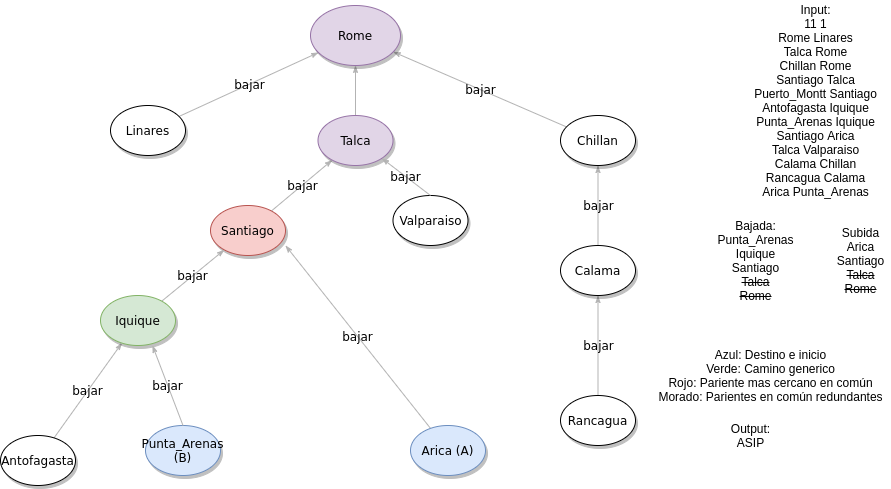

"Todos los caminos llevan a Roma"
=================================

Problema
--------

Descripción
***********

There is an ancient saying that “All Roads Lead to Rome”. If this were true, then there is a simple
algorithm for finding a path between any two cities. To go from city A to city B, a traveller could take
a road from A to Rome, then from Rome to B. Of course, a shorter route may exist.

The network of roads in the Roman Empire had a simple structure: beginning at Rome, a number
of roads extended to the nearby cities. From these cities, more roads extended to the next further
cities, and so on. Thus, the cities could be thought of as existing in levels around Rome, with cities
in the ith level only connected to cities in the i − 1th and i + 1th levels (Rome was considered to be
at level 0). No loops existed in the road network. Any city in level i was connected to a single city in
level i − 1, but was connected to zero or more cities in level i + 1. Thus, to get to Rome from a given
city in level i, a traveller could simply walk along the single road leading to the connected i − 1 level
city, and repeat this process, with each step getting closer to Rome.

Given a network of roads and cities, your task is to find the shortest route between any two given
cities, where distance is measured in the number of intervening cities.

Input
*****

The first line is the number of test cases, followed by a blank line.

The first line of each test case of the input contains two numbers in decimal notation separated by
a single space. The first number (m) is the number of roads in the road network to be considered. The
second number (n) represents the number of queries to follow later in the file.

For each test case, in the next m lines in the input each contain the names of a pair of cities separated
by a single space. A city name consists of one or more letters, the first of which is in uppercase. No
two cities begin with the same letter. The name Rome always appears at least once in this section of
input, for each test case; this city is considered to be at level 0, the lowest-numbered level. The pairs
of names indicate that a road connects the two named cities. The first city named on a line exists in a
lower level than the second named city. The road structure obeys the rules described above. For each
test case, no two lines of input in this section are repeated.

The next n lines, for each test case in the input each contain the names of a pair of cities separated
by a single space. City names are as described above. These pairs of cities are the query pairs. Your
task for each query pair is to find the shortest route from the first named city to the second. Each of
the cities in a query pair is guaranteed to have appeared somewhere in the previous input section, for
each test case, describing the road structure.

Each test case will be separated by a single line.

Output
******

In each test case, for each of the n query pairs, output a sequence of uppercase letters indicating the
shortest route between the two query pair cities. The sequence must be output as consecutive letters,
without intervening whitespace, on a single line. For each test case, the first output line corresponds
to the first query pair, the second output line corresponds to the second query pair, and so on. The
letters in each sequence indicate the first letter of the cities on the desired route between the query pair
cities, including the query pair cities themselves. A city will never be paired with itself in a query.

Print a blank line between the outputs for two consecutive test cases.

Sample Input
************

1

7 3

Rome Turin

Turin Venice

Turin Genoa

Rome Pisa

Pisa Florence

Venice Athens

Turin Milan

Turin Pisa

Milan Florence

Athens Genoa

Sample Output
*************

TRP

MTRPF

AVTG

Solución
--------

Explicación de la solución
**************************

Este es un problema de grafos en el que nos piden ir de un punto A a un punto B desde el camino más corto.
Teniendo la particularidad de que nuestro grafo siempre va a tener forma de árbol y que roma siempre será
la raiz de éste.

La primera solución que se viene a la cabeza es hacer un bfs desde el punto A hasta el punto B. Si bien esta
solución funciona en este caso en particular, no me gusta porque no es tan rápida como podría serlo, puesto
que el tiempo que demora por cada caso de prueba es la cantidad de queries * la cantidad de ciudades.

Mi solución, sin embargo, logra ser la cantidad de queries * la profundidad del árbol. Si bien el peor caso,
que es tener un arbol con solo 1 hijo en todas las etapas menos la primera, es igual de lento, la complejidad
promedio es n log n, con la base siendo la cantidad de hijos que tiene cada nodo.

Mi solución, lo que hace es aprovecharse de que este grafo es un árbol, lo que simplifica mucho las cosas
en cuanto a tiempo porque solo va a haber un camino no redundante. Esto se debe a que cada nodo tiene solo 1
nodo que está mas cerca de Roma, por lo que dice el enunciado.
Este camino consiste en ir desde A hasta el primer pariente que tienen en común y después tomar el camino
inverso de b hasta el pariente que tienen en común, es decir, A -> pariente -> B.

Al igual que la solución naive, implementa un bfs, pero a diferencia de la otra, este lo hace solo una vez,
en vez de n veces. Toma el bfs de roma como raíz, guarda la distancia que hay entre cada ciudad y roma, y
guarda el pariente de cada nodo.

Luego, sabemos que porque es un árbol con Roma como raíz, sabemos que subir a través de cada pariente nos lleva a
Roma, por cómo funcionan los árboles. Lo que en código significa leer iterativamente el mapa que tenemos que nos guía
de un nodo a su pariente, hasta llegar a Roma.

Después solo queda fijarse que si tienen algún pariente en común, de ahí en adelante todo el camino es redundante, pues
desde ese pariente puedes bajar directamente, sin tener que hacer todo el camino hasta Roma (hay que hacer este paso para
asegurarnos de que sea el camino más corto, porque es lo que nos piden). Esto en código lo implementé con un deque, porque
así es más fácil pasar de un sentido a otro, esto es util porque nos interesa el camino de A al pariente, pero después es al
revés, del pariente a B.

Y finalmente queda unir los trazos, como dije recién, hay que asegurarse que quede en el orden correcto, pero además de eso
estamos listos, solo queda formatear el problema como dice el enunciado, y esto queda como tarea para el lector.

PD: Guardar la distancia en este caso no es necesario, pues sabemos cual va a ser el camino más corto, pero para mantener el
bfs genérico, decidí dejarlo. Un simple bool revisando que no hayamos pasado por ahí anteriormente es más que suficiente.

Por ejemplo, tenemos el siguiente diagrama:

Código
******

.. code:: cpp
   :number-lines:

   #include <bits/stdc++.h>
   using namespace std;

   #define INF 10000
   map<string,vector<string>> adjlist;
   map<string,int> distancia;
   map<string,string> bajar;

   // Este es un BFS común con la única diferencia que es con maps y que guarda
   //el pariente de cada nodo (menos el de la raiz)
   void bfs (string start) {
     queue<string> colita;
     colita.push(start);
     distancia[start] = 0;
     while (!colita.empty()){
       string actual = colita.front();
       colita.pop();
       for (int i = 0; i < adjlist[actual].size(); ++i) {
         string vecino = adjlist[actual][i];
         if (distancia[vecino] == INF) {
           colita.push(vecino);
           distancia[vecino] = distancia[actual]+1;
    // Este es el mapa que referencia al pariente de cada nodo
           bajar[vecino] = actual;
         }
       }
     }
   }

   int main () {
     int t;
     cin >> t;
     for (int i = 0; i < t; ++i) {
       if (i) cout << "\n";
       int caminos, preguntas;
       cin >> caminos >> preguntas;

       // Limpiamos nuestros maps porque es un caso nuevo independiente,
       //los podría haber definido
       // dentro del for para evitar esto, pero implicaria tener que llamarlo
       //en la funcion y mucho texto (aunque es la mejor práctica).
       adjlist.clear();
       distancia.clear();
       bajar.clear();

       // Leemos el árbol y lo metemos a la lista de adyacencia,
       //aprovechamos de poner la distancia como INF temporalmente.
       for (int j = 0; j < caminos; ++j) {
         string a, b;
         cin >> a >> b;
         adjlist[a].push_back(b);
         adjlist[b].push_back(a);
         distancia[a] = INF;
         distancia[b] = INF;
       }

       // Hacemos el bfs de Roma, recordar que tambien genera el
       //mapa con los parientes de cada nodo.
       bfs("Rome");

       for (int j = 0; j < preguntas; ++j){

         // Leemos los queries
         string a, b;
         cin >> a >> b;

         // Creamos nuestra cola doble, que nos indica como ir de A
         //al pariente (bajada) y del pariente a B (subida).
         deque<string> bajada, subida;
         bajada.push_back(a);
         subida.push_back(b);

         // Vamos siguiendo el camino hasta Roma.
         while (bajada.back() != "Rome"){
           bajada.push_back(bajar[bajada.back()]);
         }
         while (subida.back() != "Rome"){
           subida.push_back(bajar[subida.back()]);
         }

         // Eliminamos todo el camino redundante que pasa por ciudades que
         //comparten en el camino, y guardamos la ultima que tienen en comun,
         // este es nuestro punto "medio" o pariente como me referi anteriormente.
         string medio;
         while (!subida.empty() && !bajada.empty() && bajada.back() == subida.back()){
           medio = bajada.back();
           bajada.pop_back();
           subida.pop_back();
         }

         string camino = "";
         // En el de bajada es front porque bajamos (más cercano a A)
         //y viceversa. Guardamos sólo el primer carácter porque es lo que
         //pide el enunciado.
         while(!bajada.empty()){
           camino += bajada.front()[0];
           bajada.pop_front();
         }
         camino += medio[0];
         while(!subida.empty()){
           camino += subida.back()[0];
           subida.pop_back();
         }
         // Lo imprimimos y ganamos.
         cout << camino << endl;
       }
     }
     return 0;
   }

Información adicional
---------------------

Link del problema: https://dmoj.ca/problem/cco96p5

Autor de la solución: Vicente Villarroel

Ilustraciones: Gabriel Carmona (ya no)

Contacto en caso de dudas:
**************************

Discord: 5038#1629

Email: ele38@pm.me
